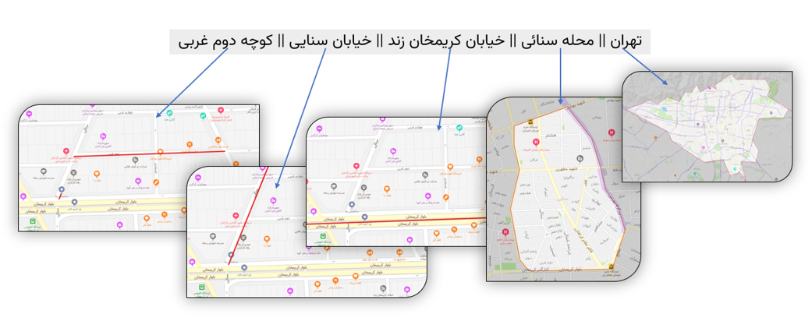
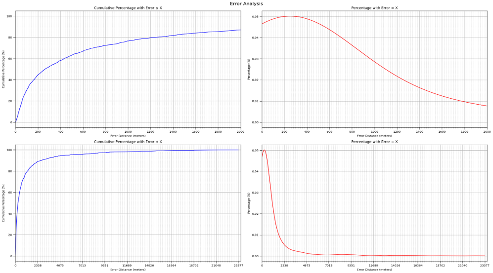

# ابزار آدرسیابی فارسی با مدل پنهان مارکوف

## معرفی

این پروژه به توسعه یک ابزار هوشمند برای آدرسیابی آدرس‌های پستی فارسی می‌پردازد. ابزار طراحی‌شده با استفاده از مدل پنهان مارکوف (HMM) به گونه‌ای طراحی شده که بتواند آدرس‌های متنی را با دقت بالا به مختصات جغرافیایی تبدیل کند.

## هدف پروژه

بهبود آدرسیابی برای آدرس‌های فارسی که به دلیل تنوع در ساختار و نبود استاندارد، چالش‌برانگیز هستند. این ابزار نه تنها برای شهرهای بزرگ، بلکه برای شهرها و روستاهای کوچک نیز کاربرد دارد.

## روش پیاده‌سازی

- **پیش‌پردازش آدرس**: حذف علائم نگارشی، فواصل اضافی، اصلاح نویسه‌های عربی.
- **مدل‌سازی با HMM**: در این مدل، بخش‌های مختلف آدرس به عنوان مشاهدات و ساختار مخفی پشت آن‌ها به عنوان حالت‌های پنهان در نظر گرفته می‌شود.
- **تطبیق با OpenStreetMap**: با استفاده از Levenshtein Distance برای شباهت و فاصله اقلیدسی برای پیوستگی منطقی بین بخش‌ها.
- **نرمال‌سازی احتمال‌ها**: از تابع SoftMax و نرمال‌سازی گوسی استفاده شده تا احتمال بهینه هر تطبیق محاسبه شود.
- **ذخیره و بازیابی داده‌ها با Elasticsearch**: برای افزایش سرعت بازیابی و مقیاس‌پذیری سامانه.

## نتایج

- ارزیابی ابزار با 2000 آدرس پستی نشان داد که در 87٪ موارد، حداکثر خطا کمتر از 2 کیلومتر بوده است.
- مقایسه با ابزار TehranGeocode نشان‌دهنده عملکرد بهتر این ابزار با دقت نهایی حدود 95٪ برای خطای کمتر از 5 کیلومتر است.

### توزیع خطای جغرافیایی:

## مزایای ابزار

- **پوشش مناطق روستایی و شهری**  
- **استقلال از ساختار خاص آدرس‌ها**  
- **قابلیت به‌روزرسانی بدون نیاز به بازآموزی مدل**  
- **استفاده از داده‌های محاوره‌ای آدرس**  
- **قابلیت استفاده در مسیریاب‌ها و سامانه‌های خدماتی**

## نتیجه‌گیری

این پروژه توانسته است با به‌کارگیری HMM و بهره‌گیری از داده‌های OpenStreetMap، ابزار قابل اعتمادی برای آدرسیابی فارسی ارائه دهد. ساختار ماژولار و دقت بالا، این ابزار را برای استفاده در پروژه‌های صنعتی و پژوهشی آماده کرده است.

## پشتیبانی و حقوق مادی

این پروژه با حمایت شرکت [کندا ایده](https://www.kandaidea.com/en) و با هدف استفاده در سامانه‌های خدمات مشتریان این شرکت توسعه یافته است. تمامی حقوق مادی و معنوی این نرم‌افزار برای شرکت **کندا ایده** محفوظ است.

## پژوهشگران

- **دانشجو**: محمدرضا بخشایش  
- **استاد راهنما**: دکتر احمد کلهر  
- **دانشگاه**: دانشکده مهندسی برق و کامپیوتر، دانشگاه تهران
- 

## منابع

1. Mazochi, R. et al., *Persian Address Geocoding: an LALR Parsing and Dynamic Programming Approach*, Journal of AI and Data Mining, 2023.  
2. Javidaneh, F. et al., *How Much Do We Learn from Addresses?*, ISPRS International Journal of Geo-Information, 2020.  
3. Koumarelas, A. et al., *Enhancing Address Matching with Geocoding and Similarity Measure Selection*, J. Data and Information Quality, 2018.
